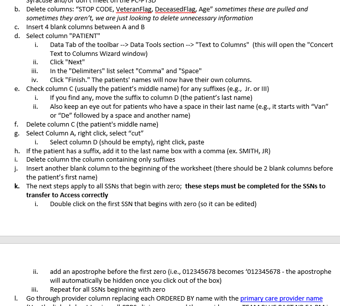
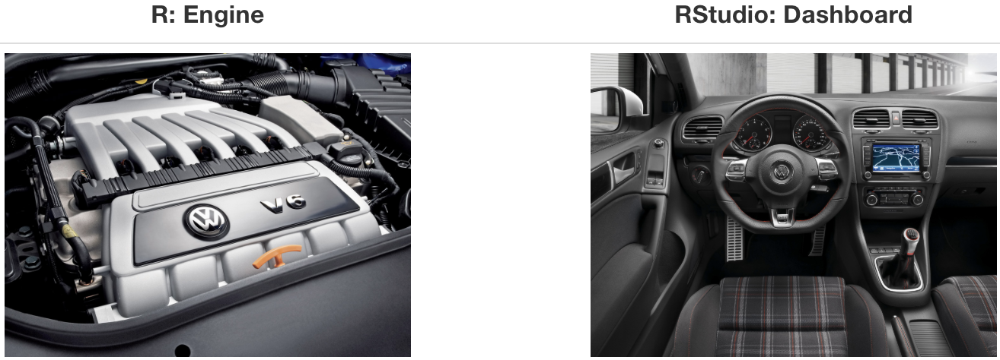

```{r setup, include=FALSE}
library(tidyverse)
library(fontawesome)
library(dsbox)
library(DT)
library(memer)


knitr::opts_chunk$set(fig.retina = 3, warning = FALSE, message = FALSE)

#xaringan::inf_mr(cast_from = "..")
```

## What we will cover today

- Just the tip of the iceberg...

- There's not enough time to cover everything

- The content presented today is largely based on the [Data science in a Box](https://datasciencebox.org/content/explore/) materials

- Given our roles, we will focus on:

  1. How to start interacting with R  
  
  2. How to wrangle data in R  

--

### Things we won't cover 

...but I'll gladly help you with otherwise:

- Advanced data wrangling
- Detailed data visualization
- Data modelling
- Handling spatial data

---

class: center, middle

# What is Data Wrangling?

---

class: center 

## The data analysis cycle


.center[
>Anyone who has ever taken wild-caught data through the full process of analysis knows that statistics, in the strict sense of fitting models and doing inference, is but one small part of the process.
>
> Bryan & Wickham ([2017](https://www.tandfonline.com/doi/full/10.1080/10618600.2017.1389743))  
]

.center[

]

---

## Who Am I?

- Coordinator in Dr. Possemato's lab

- Fairly new to CIH (less than a year)

- Learned R (largely on my own) during graduate school 

- Trained in biostats

- Enjoy the challenge of wrangling [messy data](https://brohrer.github.io/data_science_archetypes.html)


.center[

]

---

class: right, middle

## Find me at...

`r fontawesome::fa("location-arrow")` BHOC F204
`r fontawesome::fa("envelope")` ivan.castro@va.gov    
`r fontawesome::fa("envelope")` iecastro@syr.edu
`r fontawesome::fa("github")` [iecastro](https://github.com/iecastro) 
`r fontawesome::fa("linkedin")` [iecastro](https://www.linkedin.com/in/iecastro)
---

class: title-slide

# Meet the toolkit <br> `r emo::ji('hammer_and_pick')`

---

## Toolkit


- Scriptability $\rightarrow$ R
- Literate programming (code, narrative, output in one place) $\rightarrow$ R Markdown
- Version control $\rightarrow$ Git / GitHub


---
class: center, middle

# Reproducible data wrangling and analysis

---

## Reproducibility checklist

.question[
What does it mean for a data analysis to be "reproducible"?
]

--

Near-term goals:

- Are the tables and figures reproducible from the code and data?
- Does the code actually do what you think it does?
- In addition to what was done, is it clear **why** it was done? 
(e.g., how were parameter settings chosen?)

Long-term goals:

- Can the code be used for other data?
- Can you extend the code to do other things?

---

## From manual tasking...

```{r fig.align="center", out.width = 550, out.height= 500, echo=FALSE}

```

---

## ... to reproducible code

```{r fig.align="center", out.width = 600, out.height= 500, echo=FALSE}

```

---

## Reproducible plots


---

class: center, middle

# R and RStudio

---

## What is R

- R is a statistical programming language

- But why learn programming?

--

>You must use a computer to do data science; you cannot do it in your head, or with pencil and paper.
>
>Hadley Wickham
>

.center[

]


- Don't be discouraged by the word _programming_; R is first and foremost for data analysis  

.footnote[
➥ Source: [R for Data Science](https://r4ds.had.co.nz/)
]


---
## What is RStudio?

- RStudio is a convenient interface for R (an integreated development environment, IDE)
- At its simplest:<sup>➥</sup>
    - R is like a car’s engine
    - RStudio is like a car’s dashboard

```{r fig.align="center", echo=FALSE}

```

.footnote[
➥ Source: [Modern Dive](https://moderndive.com/)
]

---

## `r fontawesome::fa("cloud")`  Let's take a tour - R / RStudio

Follow this link and log in with your google account: 

https://rstudio.cloud/project/395951


--

Concepts introduced:

- Console
- Using R as a calculator
- Environment
- Loading and viewing a data frame
- Accessing a variable in a data frame
- R functions

---

## R essentials

A short list (for now):

- Functions are (most often) verbs, followed by what they will be applied to in parantheses:

```{r eval=FALSE}
do_this(to_this)
do_that(to_this, to_that, with_those)
```

--

- Columns (variables) in data frames are accessed with `$`:

```{r eval=FALSE}
dataframe$var_name
```

--

- Packages are installed with the `install.packages` function and loaded with the `library` function, once per session:

```{r eval=FALSE}
install.packages("package_name")
library(package_name)

```

--

- For this project we'll need the following packages: 

```{r eval = FALSE}
install.packages(c("tidyverse", "devtools", "datasauRus", "fivethirtyeight", "janitor", "DT"))
```

---

## tidyverse

.pull-left[

]

.pull-right[
.center[
[tidyverse.org](https://www.tidyverse.org/)
]

- The tidyverse is an opinionated collection of R packages designed for data science. 

- All packages share an underlying philosophy and a common grammar. 
]

---

class: center, middle

# R Markdown

---


## R Markdown

- Fully reproducible reports -- each time you knit the analysis is ran from the beginning

- Simple markdown syntax for text

- Code goes in chunks, defined by three backticks, narrative goes outside of chunks

---

## `r fontawesome::fa("laptop")` Let's take a tour - R Markdown


Go to RStudio Cloud and open the application exercise Bechdel.

    ~/appex/ae-bechdel.Rmd

Concepts introduced:

- Knitting documents

- R Markdown and (some) R syntax

---

## `r fontawesome::fa("code")` Bechdel Test 

.question[
What is the Bechdel test?
]

--

The Bechdel test asks whether a work of fiction features at least two women who talk to each other about something other than a man, and there must be two women named characters.

--

- Knit the R Markdown document.

---

## Other things you can make in R Markdown

`r fontawesome::fa("file-powerpoint")` This presentation was written in R Markdown
`r fontawesome::fa("file")` [HTML resume](https://iecastro.github.io/web-resume)
`r fontawesome::fa("link")` [Blog / Website](https://iecastro.github.io/blog/2018-09-13/ndi-dist-prof.html)

--

... ok, enough self promotion `r emo::ji("man_office_worker")`

---
## R Markdown help

.pull-left[
.center[
[R Markdown cheat sheet](https://github.com/rstudio/cheatsheets/raw/master/rmarkdown-2.0.pdf)
]

]
.pull-right[
.center[
Markdown Quick Reference  
`Help -> Markdown Quick Reference`
]

]

---

## Workspaces

Remember this, and expect it to bite you a few times as you're learning to work 
with R Markdown: The workspace of your R Markdown document is separate from the Console!

- Run the following in the console
```{r eval = FALSE}
x <- 2
x * 3
```
.question[
All looks good, eh?
]

--

- Then, add the following chunk in your R Markdown document and knit it

```{r eval = FALSE}
x * 3
```
.question[
What happens? Why the error?
]

---

class: center, middle

# Git and GitHub

---

## Version control

- GitHub as a platform for collaboration

- It's actually designed for version control

---

## Versioning

```{r echo=FALSE, fig.align = "center", out.width = 1200}
knitr::include_graphics("img/lego-steps.png")
```

---

## Versioning 

with human readable messages

```{r echo=FALSE, fig.align = "center", out.width = 1200}
knitr::include_graphics("img/lego-steps-commit-messages.png")
```

---

## Why do we need version control?

```{r echo=FALSE, fig.align = "center"}
knitr::include_graphics("img/phd_comics_vc.gif")
```

---

# Git and GitHub tips

- Git is a version control system -- like “Track Changes” features from Microsoft Word on steroids. GitHub is the home for your Git-based projects on the internet -- like DropBox but much, much better).

- __This is outside the scope of this workshop.__

- There is a great resource for working with git and R: [happygitwithr.com](http://happygitwithr.com/).

---

class: title-slide

# Tidy data and data wrangling <br> `r emo::ji('wrench')`

---

class: center, middle
name: tidy

# Tidy data

---

## Tidy data

>Happy families are all alike; every unhappy family is unhappy in its own way. 
>
>Leo Tolstoy
>

--

.pull-left[
**Characteristics of tidy data:**  `r emo::ji("smile")`

- Each variable forms a column.
- Each observation forms a row.
- Each type of observational unit forms a table.
]


.pull-right[
**Characteristics of untidy data:**  `r emo::ji("frowning")`

!@#$%^&*()
]

--


.footnote[
➥ Source: [R for Data Science](https://r4ds.had.co.nz/)
]

---

class: middle

>Like families, tidy datasets are all alike but every messy dataset is messy in its own way.
>
>Hadley Wickham


---
## Summary tables 

.question[
Is each of the following a dataset or a summary table?
]

.small[
.pull-left[
```{r echo=FALSE}
starwars %>%
  select(name, height, mass)
```
]


.pull-right[
```{r echo=FALSE}
starwars %>%
  group_by(gender) %>%
  summarize(avg_height = round(mean(height, na.rm = TRUE), 2))
```
]
]

---

class: center, middle

# Pipes

---

## Where does the name come from?

The pipe operator is implemented in the package **magrittr**, it's pronounced 
"and then".


.pull-left[

]
.pull-right[

]

.footnote[
➥ Vignette: [magrittr](https://cran.r-project.org/web/packages/magrittr/vignettes/magrittr.html)
]


---

## Review: How does a pipe work?

- You can think about the following sequence of actions - find key, 
unlock car, start car, drive to school, park.

--

- Expressed as a set of nested functions in R pseudocode this would look like:
```{r eval=FALSE}
park(drive(start_car(find("keys")), to = "campus"))
```

--

- Writing it out using pipes give it a more natural (and easier to read) 
structure:
```{r eval=FALSE}
find("keys") %>%
  start_car() %>%
  drive(to = "campus") %>%
  park()
```

---

## What about other arguments?

To send results to a function argument other than first one or to use the previous result for multiple arguments, use `.`:

```{r fig.height=1.8, fig.width = 3.75}
starwars %>%
  filter(species == "Human") %>%
  lm(mass ~ height, data = .)
```

---

class: center, middle
name: wrangle

# Data wrangling

---

## Bike crashes in NC 2007 - 2014

The dataset is in the **dsbox** package:

- github packages require special install commands

- the **remotes** package is automatically installed with **devtools**

```{r load-data, eval=FALSE}

remotes::install_github("rstudio-education/dsbox")

library(dsbox)
ncbikecrash

```

---

## Variables

View the names of variables via
```{r}
names(ncbikecrash)
```

and see detailed descriptions with `?ncbikecrash`.

---

## Viewing your data

- In the Environment, after loading with `data(ncbikecrash)`, and click on the 
name of the data frame to view it in the data viewer

- Use the `glimpse` function to take a peek

--


```{r}
glimpse(ncbikecrash)
```

---

## A Grammar of Data Manipulation

**dplyr** is based on the concepts of functions as verbs that manipulate data frames.

.pull-left[

]
.pull-right[
.midi[
- `filter`: pick rows matching criteria
- `slice`: pick rows using index(es)
- `select`: pick columns by name
- `pull`: grab a column as a vector
- `arrange`: reorder rows
- `mutate`: add new variables
- `distinct`: filter for unique rows
- `sample_n` / `sample_frac`: randomly sample rows
- `summarise`: reduce variables to values
- ... (many more)
]
]

---

## **dplyr** rules for functions

- First argument is *always* a data frame

- Subsequent arguments say what to do with that data frame

- Always return a data frame

- Don't modify in place

---

## A note on piping and layering

- The `%>%` operator in **dplyr** functions is called the pipe operator. This means you "pipe" the output of the previous line of code as the first input of the next line of code.

- The `+` operator in **ggplot2** functions is used for "layering". This means you create the plot in layers, separated by `+`.

---

## `filter` to select a subset of rows

for crashes in Durham County

```{r}
ncbikecrash %>%
  filter(county == "Durham") #<<
```

---

## `filter` for many conditions at once

for crashes in Durham County where biker was 0-5 years old

```{r}
ncbikecrash %>%
  filter(county == "Durham", bike_age_group == "0-5")
```

---

## Logical operators in R


operator    | definition                   || operator     | definition
------------|------------------------------||--------------|----------------
`<`         | less than                    ||`x`&nbsp;&#124;&nbsp;`y`     | `x` OR `y` 
`<=`        |	less than or equal to        ||`is.na(x)`    | test if `x` is `NA`
`>`         | greater than                 ||`!is.na(x)`   | test if `x` is not `NA`
`>=`        |	greater than or equal to     ||`x %in% y`    | test if `x` is in `y`
`==`        |	exactly equal to             ||`!(x %in% y)` | test if `x` is not in `y`
`!=`        |	not equal to                 ||`!x`          | not `x`
`x & y`     | `x` AND `y`                  ||              |

---

## `select` to keep variables

```{r}
ncbikecrash %>%
  filter(county == "Durham", bike_age_group == "0-5") %>%
  select(locality, speed_limit)
```

---

## `select` to exclude variables

```{r}
ncbikecrash %>%
  select(-object_id)
```

---

## `select` a range of variables

```{r}
ncbikecrash %>%
  select(city:locality)
```

---

## `slice` for certain row numbers

First five
```{r}
ncbikecrash %>%
  slice(1:5)
```

---

## `slice` for certain row numbers

Last five
```{r}
last_row <- nrow(ncbikecrash)
ncbikecrash %>%
  slice((last_row - 4):last_row)
```

---

## `pull` to extract a column as a vector

```{r}
ncbikecrash %>%
  slice(1:6) %>%
  pull(locality)
```

vs.

```{r}
ncbikecrash %>%
  slice(1:6) %>%
  select(locality)
```

---

## `sample_n` / `sample_frac` for a random sample

- `sample_n`: randomly sample 5 observations

```{r}
ncbikecrash_n5 <- ncbikecrash %>%
  sample_n(5, replace = FALSE)
dim(ncbikecrash_n5)
```

- `sample_frac`: randomly sample 20% of observations

```{r}
ncbikecrash_perc20 <-ncbikecrash %>%
  sample_frac(0.2, replace = FALSE)
dim(ncbikecrash_perc20)
```

---

## `distinct` to filter for unique rows

And `arrange` to order alphabetically

```{r}
ncbikecrash %>% 
  select(county, city) %>% 
  distinct() %>% 
  arrange(county, city)
```

---

## `summarise` to reduce variables to values

```{r}
ncbikecrash %>%
  summarise(avg_hr = mean(crash_hour))
```

---

## `group_by` to do calculations on groups

```{r}
ncbikecrash %>%
  group_by(hit_run) %>%
  summarise(avg_hr = mean(crash_hour))
```

---

## `count` observations in groups

```{r}
ncbikecrash %>%
  count(driver_alcohol_drugs)
```

---

## `mutate` to add new variables

```{r eval=FALSE}
ncbikecrash %>%
  mutate(driver_alcohol_drugs_simplified = case_when(
    driver_alcohol_drugs == "Missing"       ~ NA,
    str_detect(driver_alcohol_drugs, "Yes") ~ "Yes",
    TRUE                                    ~ "No"
  ))
```

---

## "Save" when you `mutate`

Most often when you define a new variable with `mutate` you'll also want to save the resulting data frame, often by writing over the original data frame.

```{r}
ncbikecrash <- ncbikecrash %>%
  mutate(driver_alcohol_drugs_simplified = case_when(
    str_detect(driver_alcohol_drugs, "Yes") ~ "Yes",
    TRUE                                    ~ driver_alcohol_drugs
  ))
```

---

## Check before you move on

```{r}
ncbikecrash %>% 
  count(driver_alcohol_drugs, driver_alcohol_drugs_simplified)
```

```{r}
ncbikecrash %>% 
  count(driver_alcohol_drugs_simplified)
```

---

## `r fontawesome::fa("laptop")`  AE - NC bike crashes

- Go to the cloud project and open application exercise NC bike crashes

    ~appex/ae-ncbikecrashes.Rmd
    
- For each question you work on, set the `eval` chunk option to `TRUE` and knit

---
class: title-slide
name: coding

# Coding style <br> `r emo::ji('man_in_tuxedo')`

---

class: center, middle

# Coding style

---

## Style guide

>Good coding style is like correct punctuation: you can manage without it, butitsuremakesthingseasiertoread.
>
>Hadley Wickham

- Style guide for this course is based on the Tidyverse style guide: http://style.tidyverse.org/

- There's more to it than what we'll cover today, but we'll mention more as we introduce more functionality, and do a recap later in the semester

---

## File names and code chunk labels

- Do not use spaces in file names, use `-` or `_` to separate words
- Use all lowercase letters

```{r eval = FALSE}
# Good
ucb-admit.csv

# Bad
UCB Admit.csv
```

---

## Object names

- Use `_` to separate words in object names
- Use informative but short object names
- Do not reuse object names within an analysis

```{r eval = FALSE}
# Good
acs_employed

# Bad
acs.employed
acs2
acs_subset
acs_subsetted_for_males
```

---

```{r echo=FALSE, fig.align = "center", out.height="50%"}
knitr::include_graphics("img/meaningful-variable-name.jpg")
```

---

## Spacing

- Put a space before and after all infix operators (=, +, -, <-, etc.), and when naming arguments in function calls. 
- Always put a space after a comma, and never before (just like in regular English).

```{r eval = FALSE}
# Good
average <- mean(feet / 12 + inches, na.rm = TRUE)

# Bad
average<-mean(feet/12+inches,na.rm=TRUE)
```

---

## ggplot

- Always end a line with `+`
- Always indent the next line

```{r eval = FALSE}
# Good
ggplot(diamonds, mapping = aes(x = price)) +
  geom_histogram()

# Bad
ggplot(diamonds,mapping=aes(x=price))+geom_histogram()
```

---

## Long lines

- Limit your code to 80 characters per line. This fits comfortably on a printed page with a reasonably sized font.
- Take advantage of RStudio editor's auto formatting for indentation at line breaks.

---

## Assignment

- Use `<-` not `=`

```{r eval = FALSE}
# Good
x <- 2

# Bad
x = 2
```

--

```{r echo=FALSE, fig.align = "center"}

```

---

## Quotes

Use `"`, not `'`, for quoting text. The only exception is when the text already contains double quotes and no single quotes.

```{r eval = FALSE}
ggplot(diamonds, mapping = aes(x = price)) +
  geom_histogram() +
  # Good
  labs(title = "`Shine bright like a diamond`",
  # Good
       x = "Diamond prices",
  # Bad
       y = 'Frequency')
```

---

class: title-slide
name: types

# Data classes and types + Recoding <br> `r emo::ji('minidisc')`

---

class: center, middle

# Data classes and types

---

## Data types in R

* **logical**
* **double**
* **integer**
* **character**
* **lists**
* and some more, but we won't be focusing on those

---

## Logical & character

**logical** - boolean values `TRUE` and `FALSE`

```{r}
typeof(TRUE)
```

**character** - character strings

```{r}
typeof("hello")
typeof('world') # but remember, we use double quotations!
```

---

## Double & integer

**double** - floating point numerical values (default numerical type)

```{r}
typeof(1.335)
typeof(7)
```

**integer** - integer numerical values (indicated with an `L`)

```{r}
typeof(7L)
typeof(1:3)
```

---

## Lists

**Lists** are 1d objects that can contain any combination of R objects

.small[
```{r}
mylist <- list("A", 1:4, c(TRUE, FALSE), (1:4)/2)
mylist
```

```{r}
str(mylist)
```
]

---

## Named lists

Because of their more complex structure we often want to name the elements of a list (we 
can also do this with vectors). This can make reading and accessing the list more 
straight forward.

.small[
```{r}
myotherlist <- list(A = "hello", B = 1:4, "knock knock" = "who's there?")
str(myotherlist)
names(myotherlist)
myotherlist$B
```
]

---

## Concatenation

Vectors can be constructed using the `c()` function.

```{r}
c(1, 2, 3)
c("Hello", "World!")
c(1, c(2, c(3)))
```

---

## Coercion

R is a dynamically typed language -- it will happily convert between the various types 
without complaint.

```{r}
c(1, "Hello")
c(FALSE, 3L)
c(1.2, 3L)
```

---

## Missing Values

R uses `NA` to represent missing values in its data structures.

```{r}
typeof(NA)
```

---

## Other Special Values

`NaN` - Not a number

`Inf` - Positive infinity

`-Inf` - Negative infinity

<br/>

.pull-left[
```{r}
pi / 0
0 / 0
1/0 + 1/0
```
]
.pull-right[
```{r}
1/0 - 1/0
NaN / NA
NaN * NA
```
]

---

## Activity

.question[
What is the type of the following vectors? Explain why they have that type.
]

* `c(1, NA+1L, "C")`
* `c(1L / 0, NA)`
* `c(1:3, 5)`
* `c(3L, NaN+1L)`
* `c(NA, TRUE)`

---

## Example: Cat lovers

Go to RStudio Cloud and open the application exercise Cat Lovers.

    ~/appex/ae-catlovers.Rmd
    
A survey asked respondents their name and number of cats. The instructions said to enter the number of cats as a numerical value.

.small[
```{r message=FALSE}
cat_lovers <- read_csv("../data/cat-lovers.csv")

```

```{r echo=FALSE}
cat_lovers %>%
  datatable()
```
]

---

## Oh why won't you work?!

```{r}
cat_lovers %>%
  summarise(mean = mean(number_of_cats))
```

---

## Oh why won't you still work??!!

```{r}
cat_lovers %>%
  summarise(mean_cats = mean(number_of_cats, na.rm = TRUE))
```

---

## Take a breath and look at your data

.question[
What is the type of the `number_of_cats` variable?
]

```{r}
glimpse(cat_lovers)
```

---

## Let's take another look

.small[
```{r echo=FALSE}
cat_lovers %>%
  datatable()
```
]

---

## Sometimes you need to babysit your respondents

```{r}
cat_lovers %>%
  mutate(number_of_cats = case_when(
    name == "Ginger Clark" ~ 2,
    name == "Doug Bass"    ~ 3,
    TRUE                   ~ as.numeric(number_of_cats)
    )) %>%
  summarise(mean_cats = mean(number_of_cats))
```

---

## Always you need to respect data types

```{r}
cat_lovers %>%
  mutate(
    number_of_cats = case_when(
      name == "Ginger Clark" ~ "2",
      name == "Doug Bass"    ~ "3",
      TRUE                   ~ number_of_cats
      ),
    number_of_cats = as.numeric(number_of_cats)
    ) %>%
  summarise(mean_cats = mean(number_of_cats))
```

---

## Now that we know what we're doing...

```{r}
cat_lovers <- cat_lovers %>%
  mutate(
    number_of_cats = case_when(
      name == "Ginger Clark" ~ "2",
      name == "Doug Bass"    ~ "3",
      TRUE                   ~ number_of_cats
      ),
    number_of_cats = as.numeric(number_of_cats)
    )
```

---

## Moral of the story

- If your data does not behave how you expect it to, type coercion upon reading in the data might be the reason.

- Go in and investigate your data, apply the fix, *save your data*, live happily ever after.

---

## Vectors vs. lists

.pull-left[
.small[
```{r, error=TRUE}
x <- c(8,4,7)
```
]
.small[
```{r}
x[1]
```
]
.small[
```{r}
x[[1]]
```
]
]
--
.pull-right[
.small[
```{r}
y <- list(8,4,7)
```
]
.small[
```{r}
y[2]
```
]
.small[
```{r}
y[[2]]
```
]
]

--

<br>

**Note:** When using tidyverse code you'll rarely need to refer to elements using square brackets, but it's good to be aware of this syntax, especially since you might encounter it when searching for help online.

---

class: center, middle

# Review on your own

---
class: center, middle
name: datasets

# Data "set"

---

## Data "sets" in R

- "set" is in quotation marks because it is not a formal data class

- A tidy data "set" can be one of the following types:
    + `tibble`
    + `data.frame`
    
- We'll often work with `tibble`s:
    + `readr` package (e.g. `read_csv` function) loads data as a `tibble` by default
    + `tibble`s are part of the tidyverse, so they work well with other packages we are using
    + they make minimal assumptions about your data, so are less likely to cause hard to track bugs in your code

---

## Data frames

- A data frame is the most commonly used data structure in R, they are just a list of equal length vectors (usually atomic, but you can use generic as well). Each vector is treated as a column and elements of the vectors as rows.

- A tibble is a type of data frame that ... makes your life (i.e. data analysis) easier.

- Most often a data frame will be constructed by reading in from a file, but we can also create them from scratch.

```{r}
df <- tibble(x = 1:3, y = c("a", "b", "c"))
class(df)
glimpse(df)
```

---

## Data frames (cont.)

```{r}
attributes(df)
class(df$x)
class(df$y)
```

---

## Working with tibbles in pipelines

.question[
How many respondents have below average number of cats?
]

```{r}
mean_cats <- cat_lovers %>%
  summarise(mean_cats = mean(number_of_cats))

cat_lovers %>%
  filter(number_of_cats < mean_cats) %>%
  nrow()
```

.question[
Do you believe this number? Why, why not?
]

---

## A result of a pipeline is always a tibble

```{r}
mean_cats
class(mean_cats)
```

---

## `pull()` can be your new best friend

But use it sparingly!

```{r}
mean_cats <- cat_lovers %>%
  summarise(mean_cats = mean(number_of_cats)) %>%
  pull()

cat_lovers %>%
  filter(number_of_cats < mean_cats) %>%
  nrow()
```

--

```{r}
mean_cats
class(mean_cats)
```

---

class: center, middle
name: factors

# Factors

---

## Factors

Factor objects are how R stores data for categorical variables (fixed numbers of discrete values).

```{r}
(x = factor(c("BS", "MS", "PhD", "MS")))
```

```{r}
glimpse(x)
```

```{r}
typeof(x)
```

---

## Read data in as character strings

```{r}
glimpse(cat_lovers)
```

---

## But coerce when plotting

```{r}
ggplot(cat_lovers, mapping = aes(x = handedness)) +
  geom_bar()
```

---

## Use forcats to manipulate factors

```{r}
cat_lovers <- cat_lovers %>%
  mutate(handedness = fct_relevel(handedness, 
                                  "right", "left", "ambidextrous"))
```

```{r}
ggplot(cat_lovers, mapping = aes(x = handedness)) +
  geom_bar()
```

---

## Come for the functionality

.pull-left[
... stay for the logo
]
.pull-right[

]

- R uses factors to handle categorical variables, variables that have a fixed and known set of possible values. Historically, factors were much easier to work with than character vectors, so many base R functions automatically convert character vectors to factors.

- However, factors are still useful when you have true categorical data, and when you want to override the ordering of character vectors to improve display. The goal of the forcats package is to provide a suite of useful tools that solve common problems with factors.

.footnote[
Source: [forcats.tidyverse.org](http://forcats.tidyverse.org/)
]

---

## Recap

- Always best to think of data as part of a tibble
    + This plays nicely with the `tidyverse` as well
    + Rows are observations, columns are variables
    
- Be careful about data types / classes
    + Sometimes `R` makes silly assumptions about your data class 
        + Using `tibble`s help, but it might not solve all issues
        + Think about your data in context, e.g. 0/1 variable is most likely a `factor`
    + If a plot/output is not behaving the way you expect, first
    investigate the data class
    + If you are absolutely sure of a data class, overwrite it in your
    tibble so that you don't need to keep having to keep track of it
        + `mutate` the variable with the correct class
        
- Check out Alison Hill's "Working with Data in R"  
    `saved in the R folder of the RStudio project`

---

class: title-slide
name: resources

# Resources 

---

## Online Books

[R for Data Science](https://r4ds.had.co.nz/)

>This book will teach you how to do data science with R: You’ll learn how to get your data into R, get it into the most useful structure, transform it, visualise it and model it. 
>

[ModernDive: Statistical Inference via Data Science](https://moderndive.com/index.html)

>This is intended to be a gentle introduction to the practice of analyzing data and answering questions using data the way data scientists, statisticians, data journalists, and other researchers would.
>

[Data Visualization: A practical Introduction](https://socviz.co/)

>This book is a hands-on introduction to the principles and practice of looking at and presenting data using R and ggplot.
>

[Fundamentals of Data Visualization](https://serialmentor.com/dataviz/)

>The book is meant as a guide to making visualizations that accurately reflect the data, tell a story, and look professional.  Even though nearly all of the figures in this book were made with R and ggplot2, this is not an R book.  It focuses on the concepts and the figures, not on the code.
>


## Open source R-based Courses

*Alison Hill* - [Introduction to Biostatistics for the Basic Sciences](https://ohsu-conj620.netlify.com/index.html) - Oregon Health & Science University


*Mine Cetinkaya-Rundel* - [Intro to Data Science](http://www2.stat.duke.edu/courses/Spring18/Sta199/) - Duke

---
name: index

These links will take you to each relevant section in the presentation

- [Home](https://cih-briefr.netlify.com/#1)

- [Tidy Data](https://cih-briefr.netlify.com/#tidy)

- [Data Wrangling](https://cih-briefr.netlify.com/#wrangle)

- [Coding Style](https://cih-briefr.netlify.com/#coding)

- [Datasets in R](https://cih-briefr.netlify.com/#datasets)

- [Dealing with Factors](https://cih-briefr.netlify.com/#factors)

- [Index](https://cih-briefr.netlify.com/#index)  

- [Memes](https://cih-briefr.netlify.com/#memes)

---

class: title-slide
name: memes

# Who wants to make a meme? <br>  `r emo::ji("point_up")`

---

## Welcome to the `memer` package `r emo::ji("package")`

```{r, eval = FALSE}
remotes::install_github("sctyner/memer")
library(memer)
```

>[memer](https://sctyner.github.io/memer/index.html) is a a `tidyverse`-compatible R package for creating memes
>  

--


```{r, eval=FALSE}
meme_get("OprahGiveaway") %>% 
  meme_text_bottom("EVERYONE GETS A MEME!", size = 30)

```


```{r, echo=FALSE}

oprah <- meme_get("OprahGiveaway") %>% 
  meme_text_bottom("EVERYONE GETS A MEME!", size = 30)

oprah
```


---

## What's in the package?

```{r}
meme_list()
```

---

## Let's make a meme

--

```{r, }
meme_get("TheRockDriving") %>% 
  meme_text_rock("Hey, how do I prep for an IRB audit?", 
                 "\nPrint, \n...everything.")
```

---

## Now you try

```{r, eval = FALSE}

meme_get("SuccessKid") %>% 
  meme_text_bottom("ENTER TEXT HERE")

```

---
class: title-slide
name: coffee

# Coffee Time

.center[

]

## Can't touch this

---

class: center, middle
name: maybe


```{r echo=FALSE, fig.align = "center"}
knitr::include_graphics("img/maybe.jpg")
```

